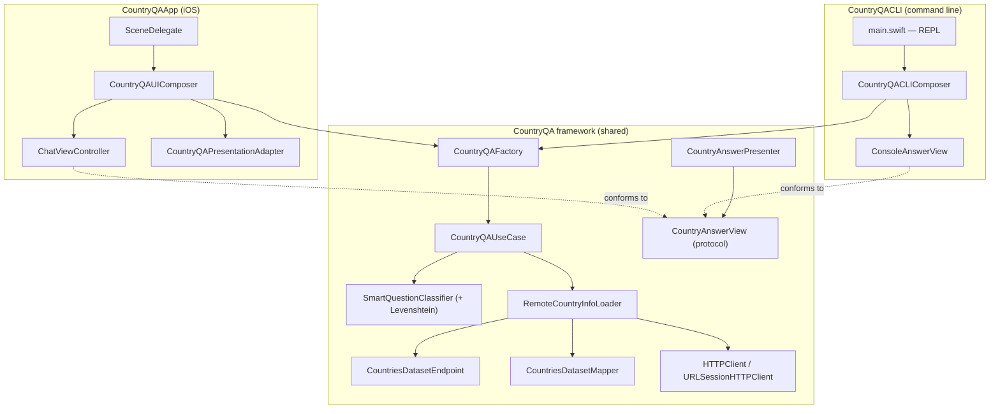

# Country Q&A

A multi-platform app that answers basic questions about countries through a chat-like
interface. The same core is reused by two front-ends — a native **iOS app** and a
**command-line app** — built following TDD, small commits, modular design, and a CI
pipeline.

## Features

The app understands four kinds of questions, phrased freely and even misspelled:

| Question | Example |
| --- | --- |
| Capital of a country | `What is the capital of Belgium?` |
| Countries starting with letters | `Which countries start with CH?` |
| ISO alpha-2 country code | `What is the ISO alpha-2 country code for Greece?` |
| Flag of a country | `What is the flag of Brazil?` |

- **Tolerant input** — questions are interpreted by a small natural-language
  classifier; country names are resolved with fuzzy matching (Levenshtein distance),
  so minor misspellings still work.
- **Error handling with retry** — when the network request fails, both apps surface an
  error and let the user retry the last question.

## Architecture

A single platform-agnostic framework (`CountryQA`) holds all the logic; each app only
adds a thin platform layer (its own view + composition root). This maximizes reuse and
keeps business logic out of the UI (MVP).

### Modules (in the `CountryQA` framework)

- **Domain** — `CountryInfo`, `CountryInfoLoader` (the abstraction the use case depends on).
- **Networking** — `HTTPClient` abstraction, `URLSessionHTTPClient`, `RemoteCountryInfoLoader`,
  and the data-source detail (`CountriesDatasetEndpoint`, `CountriesDatasetMapper`).
- **NLP** — `QuestionClassifier` / `SmartQuestionClassifier` (keyword + fuzzy + regex) and
  `LevenshteinDistance`.
- **Presentation** — `CountryQAUseCase`, `CountryAnswer`, `CountryAnswerViewModel`,
  `CountryAnswerView` (platform-agnostic view protocol), `CountryAnswerPresenter`, and the
  CLI view `ConsoleAnswerView`.
- **Composition** — `CountryQAFactory` (shared wiring for the use case).

### Platform layers

- **iOS** (`CountryQAApp`): `ChatViewController` (renders user/bot bubbles, flag images,
  and a Retry button) wired by `CountryQAUIComposer` through a `CountryQAPresentationAdapter`
  and a `WeakRefVirtualProxy`.
- **CLI** (`CountryQACLI`): a read-eval-print loop in `main.swift` wired by
  `CountryQACLIComposer`, rendering answers as text through `ConsoleAnswerView`.

Each platform supplies its own implementation of the shared `CountryAnswerView` protocol —
the iOS chat cell draws a flag image, the CLI prefixes a flag emoji — so the answer message
itself stays presentation-neutral.

## Data source

The challenge suggested `restcountries.com`. During development its `v1`–`v4` endpoints
(including `v3.1`) were **deprecated and taken down** — requests now redirect to a payload
reporting the API is gone, and `v5` requires an API key. To keep the app key-free and
runnable by anyone, it was migrated to the **[mledoze/countries](https://github.com/mledoze/countries)**
open dataset (the upstream source `restcountries` was built on), fetched as a single JSON
document and filtered client-side. Flag image URLs are derived from each country's ISO code
via **[flagcdn.com](https://flagcdn.com)**, since the dataset does not ship image URLs.

## Running

Open `CountryQAApp/CountryQAApp.xcodeproj` (Xcode 16.4).

- **iOS app** — select the `CountryQAApp` scheme and run on an iOS 18 simulator.
- **CLI app** — select the `CountryQACLI` scheme and run; type a question at the `>` prompt,
  `retry` to repeat the last question, or `quit` to exit.

## Testing

| Suite | Target | Scope |
| --- | --- | --- |
| Unit | `CountryQATests` | Domain, networking, mapper, NLP, use case, presenter |
| Snapshot | `CountryQAiOSTests` | `ChatViewController` states (light/dark, error+retry, Dynamic Type) |
| Acceptance | `CountryQAAppTests` | End-to-end through the real composition with a stubbed `HTTPClient` |
| API end-to-end | `CountryQAAPIEndToEndTests` | Hits the live dataset over the network |

- Run the unit/snapshot/acceptance suites with the **`CI_iOS`** scheme (⌘U).
- The **API end-to-end** tests depend on network reachability, so they are intentionally
  excluded from the CI test plan; run them locally with the `CountryQAApp` scheme before
  shipping changes to the networking or mapper layers.

## Continuous integration

GitHub Actions (`.github/workflows/CI-iOS.yml`) builds and tests on every push/PR with
Xcode 16.4 against the iPhone 16 / iOS 18.5 simulator, with the Thread Sanitizer, code
coverage, and randomized test ordering enabled.

## Possible improvements

- Cache the fetched dataset in the loader so repeated/fuzzy lookups avoid re-downloading
  the full document.
- Localize into additional languages (the presentation layer already uses
  `NSLocalizedString` + a `.strings` table).
