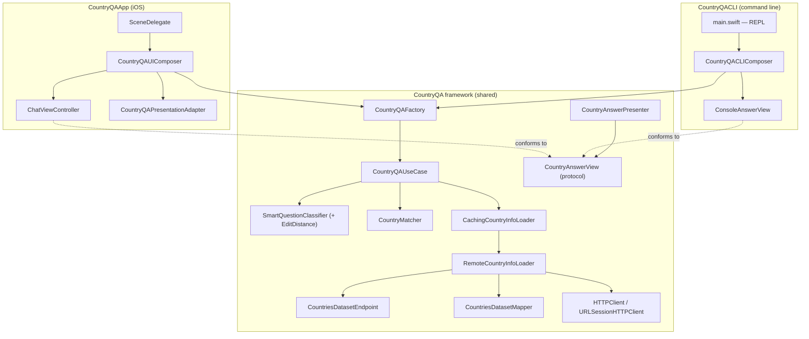

# Country Q&A

A multi-platform app that answers basic questions about countries through a chat-like
interface. The same core is reused by two front-ends — a native **iOS app** and a
**command-line app** — built following TDD, small commits, modular design, and a CI
pipeline.

## Features

The app understands four kinds of questions, phrased freely and even misspelled:

| Question | Example |
| --- | --- |
| Capital of a country | `What is the capital of Belgium?` |
| Countries starting with letters | `Which countries start with CH?` |
| ISO alpha-2 country code | `What is the ISO alpha-2 country code for Greece?` |
| Flag of a country | `What is the flag of Brazil?` |

- **Tolerant input** — questions are interpreted by a small natural-language classifier, and
  country names are resolved separately by `CountryMatcher`, so both the wording and the country
  can be misspelled (`whats teh captial of belgim` answers with Brussels).
- **Error handling with retry** — when the network request fails, both apps surface an
  error and let the user retry the last question.

### How a question is understood

The classifier splits the question **before** it looks for keywords: everything after `of` / `for`
(or after `with`) is the country or the letters, and keywords are only ever matched against the part
in front of it. The country name therefore never competes with a keyword — which matters more than it
sounds:

| Question | Naive keyword matching | This classifier |
| --- | --- | --- |
| `What is the capital of Benin?` | `Benin` is one edit from `begin`, so it reads as a *starts-with* question and fails | capital of Benin |
| `What is the flag of Cape Verde?` | `Cape` is two edits from `code`, so it answers with the **ISO code** | flag of Cape Verde |

Keyword typos are still tolerated, because the distance used is an **optimal string alignment**
distance: a swap of two adjacent letters counts as one edit, so `captial` → `capital` and `falg` →
`flag` are one edit away, while `cape` → `code` stays two apart.

Country resolution is deliberately ordered: **exact name → alternative name (`USA`, `Brasil`) →
ISO code (`BR`) → unique prefix → closest match**. Asking for `Congo` answers about Congo, not
DR Congo.

## Architecture

A single platform-agnostic framework (`CountryQA`) holds all the logic; each app only
adds a thin platform layer (its own view + composition root). This maximizes reuse and
keeps business logic out of the UI (MVP).

### Modules (in the `CountryQA` framework)

- **Domain** — `CountryInfo`, `CountryInfoLoader` (the abstraction the use case depends on), and
  `CountryMatcher` (resolves the name the user typed to a country).
- **Networking** — `HTTPClient` abstraction, `URLSessionHTTPClient`, `RemoteCountryInfoLoader`,
  and the data-source detail (`CountriesDatasetEndpoint`, `CountriesDatasetMapper`).
- **NLP** — `QuestionClassifier` / `SmartQuestionClassifier` (structural split + fuzzy keywords) and
  `editDistance`.
- **Presentation** — `CountryQAUseCase`, `CountryAnswer`, `CountryAnswerViewModel`,
  `CountryAnswerView` (platform-agnostic view protocol), `CountryAnswerPresenter`, and the
  CLI view `ConsoleAnswerView`.
- **Composition** — `CountryQAFactory` (shared wiring for the use case).

### Platform layers

- **iOS** (`CountryQAApp`): `ChatViewController` (renders user/bot bubbles, flag images,
  and a Retry button) wired by `CountryQAUIComposer` through a `CountryQAPresentationAdapter`
  and a `WeakRefVirtualProxy`.
- **CLI** (`CountryQACLI`): `main.swift` only reads stdin and writes stdout; the session logic lives
  in `CountryQAConsole` inside the shared framework, so it is covered by the same unit tests as
  everything else.

Each platform supplies its own implementation of the shared `CountryAnswerView` protocol —
the iOS chat cell draws a flag image, the CLI prefixes a flag emoji — so the answer message
itself stays presentation-neutral.

## Data source

The challenge suggested `restcountries.com`. During development its `v1`–`v4` endpoints
(including `v3.1`) were **deprecated and taken down** — requests now redirect to a payload
reporting the API is gone, and `v5` requires an API key. To keep the app key-free and
runnable by anyone, it was migrated to the **[mledoze/countries](https://github.com/mledoze/countries)**
open dataset (the upstream source `restcountries` was built on), fetched as a single JSON
document and filtered client-side. Flag image URLs are derived from each country's ISO code
via **[flagcdn.com](https://flagcdn.com)**, since the dataset does not ship image URLs.

## Running

Open `CountryQAApp/CountryQAApp.xcodeproj` (Xcode 16.4).

- **iOS app** — select the `CountryQAApp` scheme and run on an iOS 18 simulator.
- **CLI app** — select the `CountryQACLI` scheme and run; type a question at the `>` prompt,
  `retry` to repeat the last question, or `quit` to exit.

## Testing

| Suite | Target | Scope |
| --- | --- | --- |
| Unit | `CountryQATests` | Domain, networking, mapper, NLP, use case, presenter |
| Snapshot | `CountryQAiOSTests` | `ChatViewController` states (light/dark, error+retry, Dynamic Type) |
| Acceptance | `CountryQAAppTests` | End-to-end through the real composition with a stubbed `HTTPClient` |
| API end-to-end | `CountryQAAPIEndToEndTests` | Hits the live dataset over the network |

- Run the unit/snapshot/acceptance suites with the **`CI_iOS`** scheme (⌘U).
- The **API end-to-end** tests depend on network reachability and on a third-party dataset being up,
  so they are intentionally excluded from the CI test plan — a red CI should mean the code is broken,
  not that someone else's server is. Run them on demand with the **`CountryQAAPIEndToEnd`** scheme
  before shipping changes to the networking or mapper layers; they check that the live dataset still
  resolves Benin, Cape Verde and Congo correctly.

## Continuous integration and delivery

**CI** (`.github/workflows/CI-iOS.yml`) runs on every push and PR with Xcode 16.4:

1. builds and tests the `CI_iOS` scheme on an iPhone 16 / iOS 18.5 simulator, with the Thread
   Sanitizer, code coverage, and randomized test ordering enabled;
2. builds the `CountryQACLI` executable for macOS, so the command-line deliverable cannot silently
   break while the iOS app stays green.

**CD** (`.github/workflows/CD.yml`) runs automatically after a green CI run on `main`
(`workflow_run`), so nothing is ever delivered from a red build. It produces two downloadable
artifacts:

| Artifact | What it is |
| --- | --- |
| `CountryQACLI-macos` | The **runnable** command-line tool plus the `CountryQA.framework` it loads at `@loader_path`. Download, unzip, run — it answers questions at the `>` prompt. |
| `CountryQAApp-xcarchive` | An unsigned `xcarchive` of the iOS app, ready to be exported once a signing identity exists. |

The CLI needs no code signing, so its delivery is complete: the artifact is the product. The iOS
leg stops one step short — `xcodebuild -exportArchive` and any store upload need an Apple Developer
signing identity, which a public course submission does not ship, so the pipeline archives the app
but does not sign it.

## Design decisions

- **The dataset is fetched once.** It is a single 1.4 MB document describing every country, so
  `CachingCountryInfoLoader` decorates the remote loader and reuses it for every later question. A
  failed load is not cached, so the next question retries. Concurrent questions share one in-flight
  request rather than starting several.
- **Loading and matching are separate.** The loader returns every country; `CountryMatcher` decides
  which one the user meant. Splitting them is what makes exact-match-first resolution possible, and
  it removed the three separate downloads the previous fuzzy-lookup path performed per question.
- **The flag emoji comes from the data source and is always shown.** The flag image is fetched from
  flagcdn.com as an enhancement, and the answer is complete without it — if the image fails to load,
  the user still sees the flag.
- **Snapshot comparison allows no colour slop.** The assertion re-encodes the rendered image through
  PNG before comparing, so a wide-gamut render is not compared against an sRGB reference, and then
  requires every compared pixel to match exactly (at most 1% of pixels may differ, which absorbs
  cross-machine text reflow). The looser tolerance this replaces was wide enough to pass an entirely
  redesigned chat bubble.

## Possible improvements

- Persist the dataset between launches so the first question of a session is instant offline.
- Localize into additional languages (the presentation layer already uses
  `NSLocalizedString` + a `.strings` table).
