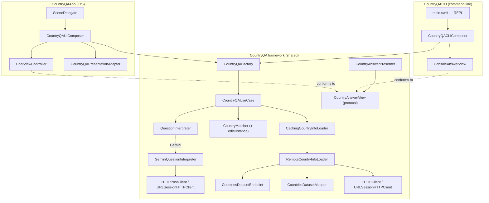

# Country Q&A

A multi-platform app that answers basic questions about countries through a chat-like
interface. The same core is reused by two front-ends — a native **iOS app** and a
**command-line app** — built following TDD, small commits, modular design, and a CI/CD
pipeline.

## Features

The app understands four kinds of questions, phrased freely and even misspelled:

| Question | Example |
| --- | --- |
| Capital of a country | `What is the capital of Belgium?` |
| Countries starting with letters | `Which countries start with CH?` |
| ISO alpha-2 country code | `What is the ISO alpha-2 country code for Greece?` |
| Flag of a country | `What is the flag of Brazil?` |

- **Tolerant input** — questions are interpreted by an LLM (Google Gemini), so any phrasing works,
  including terse (`countries starting GR`) or misspelled (`whats teh flag of brasil`) ones. Country
  names are then resolved separately by `CountryMatcher`, so the country can be misspelled too.
- **Error handling with retry** — when a request fails, both apps show an error and let the user
  retry. In the chat, each error bubble retries *its own* question, not whatever was asked last.

## How a question is interpreted

The interpreter has one job: turn free text into a typed `QuestionIntent`
(`capitalOf`, `countriesStartingWith`, `isoCode`, `flagOf`, or `unknown`) plus its argument. It does
**not** answer the question — the facts always come from the country dataset, never from the model,
so the app can never report an out-of-date capital or an invented flag. Asking *"which countries
start with GR"* is answered by filtering the full dataset, which an LLM could not enumerate reliably.

`GeminiQuestionInterpreter` calls Gemini with a **structured-output schema** (`responseSchema`), so
the reply is guaranteed to be JSON of the shape `{"intent": ..., "argument": ...}` — parsed directly
into `QuestionIntent`, with no keyword lists or regular expressions to maintain.

Once the intent is known, `CountryMatcher` resolves the argument to a country. Resolution is
deliberately ordered: **exact name → alternative name (`USA`, `Brasil`) → ISO code (`BR`) → unique
prefix → closest match** by an optimal string-alignment distance (a swap of two adjacent letters
counts as one edit, so `belgim` → `Belgium`). Asking for `Congo` answers about Congo, not DR Congo.

## Architecture

A single platform-agnostic framework (`CountryQA`) holds all the logic; each app only
adds a thin platform layer (its own view + composition root). This maximizes reuse and
keeps business logic out of the UI (MVP).

```mermaid
flowchart TD
    subgraph CLIApp["CountryQACLI (command line)"]
        MAIN["main.swift — REPL"] --> CLIC["CountryQACLIComposer"]
        CLIC --> CONSOLE["ConsoleAnswerView"]
    end

    subgraph iOSApp["CountryQAApp (iOS)"]
        SCENE["SceneDelegate"] --> UIC["CountryQAUIComposer"]
        UIC --> CHAT["ChatViewController"]
        UIC --> ADAPTER["CountryQAPresentationAdapter"]
    end

    subgraph Core["CountryQA framework (shared)"]
        FACTORY["CountryQAFactory"] --> USECASE["CountryQAUseCase"]
        USECASE --> INTERP["QuestionInterpreter"]
        INTERP -. Gemini .-> GEMINI["GeminiQuestionInterpreter"]
        GEMINI --> POST["HTTPPostClient / URLSessionHTTPClient"]
        USECASE --> MATCHER["CountryMatcher (+ editDistance)"]
        USECASE --> CACHE["CachingCountryInfoLoader"]
        CACHE --> LOADER["RemoteCountryInfoLoader"]
        LOADER --> ENDPOINT["CountriesDatasetEndpoint"]
        LOADER --> MAPPER["CountriesDatasetMapper"]
        LOADER --> HTTP["HTTPClient / URLSessionHTTPClient"]
        PRESENTER["CountryAnswerPresenter"] --> VIEW["CountryAnswerView (protocol)"]
    end

    CLIC --> FACTORY
    UIC --> FACTORY
    CONSOLE -. conforms to .-> VIEW
    CHAT -. conforms to .-> VIEW
```

### Modules (in the `CountryQA` framework)

- **Domain** — `CountryInfo`, `CountryInfoLoader` (the abstraction the use case depends on), and
  `CountryMatcher` (resolves the name the user typed to a country).
- **Networking** — `HTTPClient` (GET) and `HTTPPostClient` (POST) abstractions, `URLSessionHTTPClient`
  (both), `RemoteCountryInfoLoader`, and the data-source detail (`CountriesDatasetEndpoint`,
  `CountriesDatasetMapper`).
- **NLP** — `QuestionInterpreter` / `QuestionIntent` (the interpretation abstraction),
  `GeminiQuestionInterpreter` (the Gemini-backed implementation), and `editDistance` (used by
  `CountryMatcher` for fuzzy name resolution).
- **Presentation** — `CountryQAUseCase`, `CountryAnswer`, `CountryAnswerViewModel`,
  `CountryAnswerView` (platform-agnostic view protocol), `CountryAnswerPresenter`, and the
  CLI view `ConsoleAnswerView`.
- **Composition** — `CountryQAFactory` (shared wiring for the use case and the interpreter).

### How errors and concurrency are handled

- `CountryQAUseCase.answer` is `async throws`. A question that is *understood but unanswerable*
  (`.unknown`, `.countryNotFound`) is a normal returned value; only an interpreter or network
  **failure** throws, and only a failure offers a retry — the two are never conflated.
- The retry is bound to the question that failed. The error view model carries its own
  `retryQuestion`, so tapping retry on an old error bubble re-asks *that* question.
- `CountryQAPresentationAdapter` serializes asks: each one awaits the previous before presenting, so
  answers always appear in the order the questions were asked, never out of order because two Tasks
  raced. Closure callbacks are avoided in favour of a single structured-concurrency path.

### Platform layers

- **iOS** (`CountryQAApp`): `ChatViewController` (renders user/bot bubbles, flag images,
  and a Retry button) wired by `CountryQAUIComposer` through a `CountryQAPresentationAdapter`
  and a `WeakRefVirtualProxy`.
- **CLI** (`CountryQACLI`): `main.swift` only reads stdin and writes stdout; the session logic lives
  in `CountryQAConsole` inside the shared framework, so it is covered by the same unit tests as
  everything else.

## Configuration: the Gemini API key

Interpretation calls the Gemini API, which needs a free API key from
[Google AI Studio](https://aistudio.google.com/apikey). The app reads it from the
`GEMINI_API_KEY` environment variable and **never stores it in the repository**:

- **iOS** — set `GEMINI_API_KEY` in the run scheme's *Environment Variables*.
- **CLI** — `export GEMINI_API_KEY=...` before running.

The default model is the `gemini-flash-lite-latest` alias, so it always points at the current Flash
Lite model and keeps working as older named models are retired. Lite is enough here — the model only
classifies the question, it never produces an answer — and it stays within the free tier's rate
limit, which the larger Flash models exhaust after a handful of questions. Without a key the apps
still run, but every interpretation fails gracefully into the retry path rather than crashing.

## Data source

The challenge suggested `restcountries.com`. During development its `v1`–`v4` endpoints
(including `v3.1`) were **deprecated and taken down** — requests now redirect to a payload
reporting the API is gone, and later versions require an API key. To keep the country data key-free
and runnable by anyone, it was migrated to the **[mledoze/countries](https://github.com/mledoze/countries)**
open dataset (the upstream source `restcountries` was built on), fetched as a single JSON
document and filtered client-side. Flag image URLs are derived from each country's ISO code
via **[flagcdn.com](https://flagcdn.com)**, since the dataset does not ship image URLs.

## Running

Open `CountryQAApp/CountryQAApp.xcodeproj` (Xcode 16.4) and set `GEMINI_API_KEY` (see above).

- **iOS app** — select the `CountryQAApp` scheme and run on an iOS 18 simulator.
- **CLI app** — select the `CountryQACLI` scheme and run; type a question at the `>` prompt,
  `retry` to repeat the last question, or `quit` to exit.

## Testing

| Suite | Target | Scope |
| --- | --- | --- |
| Unit | `CountryQATests` | Domain, networking, mapper, Gemini interpreter (stubbed HTTP), use case, presenter |
| Snapshot | `CountryQAiOSTests` | `ChatViewController` states (light/dark, error+retry, Dynamic Type) |
| Acceptance | `CountryQAAppTests` | End-to-end through the real composition with a stubbed `HTTPClient` and interpreter |
| API end-to-end | `CountryQAAPIEndToEndTests` | Hits the live dataset, and the live Gemini API (skipped unless `GEMINI_API_KEY` is set) |

- Run the unit/snapshot/acceptance suites with the **`CI_iOS`** scheme (⌘U). They never touch the
  network — the Gemini interpreter is tested against a stubbed `HTTPPostClient`.
- The **API end-to-end** tests depend on network reachability and third-party services, so they are
  intentionally excluded from the CI test plan — a red CI should mean the code is broken, not that
  someone else's server is. The Gemini end-to-end test skips itself unless `GEMINI_API_KEY` is set;
  because an iOS Simulator test does not inherit the shell environment, set the key in the
  `CountryQAAPIEndToEnd` scheme's environment (or exercise the live path through the CLI).

## Continuous integration and delivery

**CI** (`.github/workflows/CI-iOS.yml`) runs on every push and PR with Xcode 16.4:

1. builds and tests the `CI_iOS` scheme on an iPhone 16 / iOS 18.5 simulator, with the Thread
   Sanitizer, code coverage, and randomized test ordering enabled;
2. builds the `CountryQACLI` executable for macOS, so the command-line deliverable cannot silently
   break while the iOS app stays green.

**CD** (`.github/workflows/CD.yml`) runs automatically after a green CI run on `main`
(`workflow_run`), so nothing is ever delivered from a red build. It produces two downloadable
artifacts:

| Artifact | What it is |
| --- | --- |
| `CountryQACLI-macos` | The **runnable** command-line tool plus the `CountryQA.framework` it loads at `@loader_path`. Download, unzip, run — it answers questions at the `>` prompt (set `GEMINI_API_KEY` first). |
| `CountryQAApp-xcarchive` | An unsigned `xcarchive` of the iOS app, ready to be exported once a signing identity exists. |

The CLI needs no code signing, so its delivery is complete: the artifact is the product. The iOS
leg stops one step short — `xcodebuild -exportArchive` and any store upload need an Apple Developer
signing identity, which a public course submission does not ship, so the pipeline archives the app
but does not sign it.

## Design decisions

- **The LLM interprets; the dataset answers.** Gemini only maps free text to a typed intent and
  argument; every fact is looked up in the country dataset. This keeps answers correct and current
  and makes the whole flow testable without the network — the use case is driven by a stubbed
  interpreter, and `GeminiQuestionInterpreter` by a stubbed HTTP client.
- **Structured output instead of parsing.** Asking Gemini for a `responseSchema`-constrained JSON
  object removes the brittle keyword/regex classification the previous version relied on.
- **The dataset is fetched once.** It is a single 1.4 MB document describing every country, so
  `CachingCountryInfoLoader` decorates the remote loader and reuses it for every later question. A
  failed load is not cached, so the next question retries. Concurrent questions share one in-flight
  request rather than starting several.
- **Errors are not answers, and retry is per question.** Failures throw and are presented as a
  retryable bubble carrying the exact question that failed; understood-but-unanswerable results are
  ordinary answers with no retry.
- **The flag emoji comes from the data source and is always shown.** The flag image is fetched from
  flagcdn.com as an enhancement, and the answer is complete without it — if the image fails to load,
  the user still sees the flag.
- **Snapshot comparison allows no colour slop.** The assertion re-encodes the rendered image through
  PNG before comparing, so a wide-gamut render is not compared against an sRGB reference, and then
  requires every compared pixel to match exactly (at most 1% of pixels may differ, which absorbs
  cross-machine text reflow).

## Possible improvements

- Route the Gemini call through a tiny hosted proxy (like the Challenge #4 middleware) so the client
  needs no key at all.
- Persist the dataset between launches so the first question of a session is instant offline.
- Localize into additional languages (the presentation layer already uses
  `NSLocalizedString` + a `.strings` table).
